# 🌌 Space Mission Control System

A **cloud-native**, micro-services platform for end-to-end orchestration of space missions: from operator authentication and enterprise management, through mission lifecycles and spacecraft command & telemetry, to real-time dashboards.  

---

## Table of Contents

1. [Architecture Overview](#architecture-overview)  
2. [Core Service Flows](#core-service-flows)  
   - [Authentication Flow](#authentication-flow)  
   - [Enterprise Service](#enterprise-service)  
   - [Gateway Routing](#gateway-routing)  
   - [Mission Service](#mission-service)  
   - [Spacecraft Service](#spacecraft-service)  
   - [Telemetry Service](#telemetry-service)  
   - [Dashboard Service](#dashboard-service)  
3. [Observability (LGTM Stack)](#observability-lgtm-stack)  
4. [Kubernetes Deployment Flow](#kubernetes-deployment-flow)  
5. [Domain Model (Class Diagram)](#domain-model-class-diagram)  
6. [CI/CD with Jenkins](#cicd-with-jenkins)  
7. [Infrastructure as Code with Terraform](#infrastructure-as-code-with-terraform)  
8. [Getting Started](#getting-started)  
9. [Contributing](#contributing)  
10. [License](#license)  

---

## Architecture Overview

A high-level view of all components—micro-services, databases, messaging and observability—deployed on Kubernetes, with CI/CD through Jenkins and IaC via Terraform:

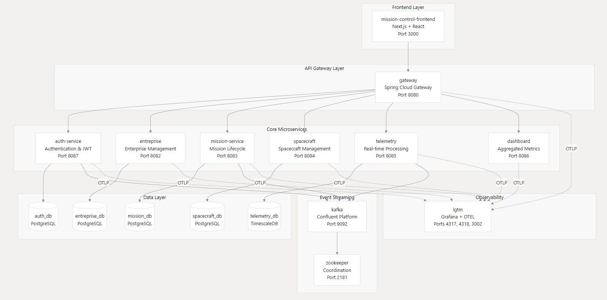  
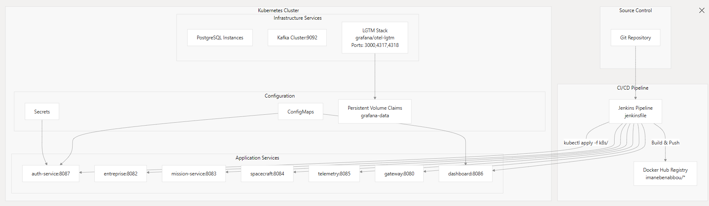  
*Figure 1: End-to-end topology across API Gateway, services, PostgreSQL, Kafka/Zookeeper, and LGTM stack.*

---

## Core Service Flows

### Authentication Flow

OAuth2 login, user sync and JWT issuance:

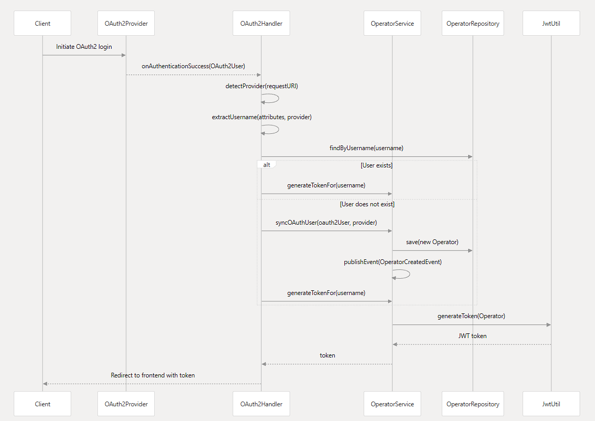  
*Figure 2: Sequence from client → OAuth2 provider → handler → `OperatorService` → token generation.*

---

### Enterprise Service

Aggregates data from Auth, Mission and Spacecraft services, and exposes both CRUD and aggregation endpoints:

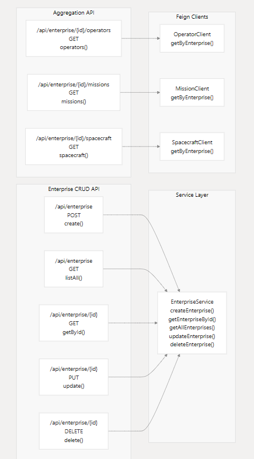  
*Figure 3: `/api/enterprise` CRUD APIs and aggregation endpoints (`/operators`, `/missions`, `/spacecraft`) backed by Feign clients.*

---

### Gateway Routing

All external HTTP/WebSocket traffic funnels through the API Gateway, which multiplexes to each micro-service path:

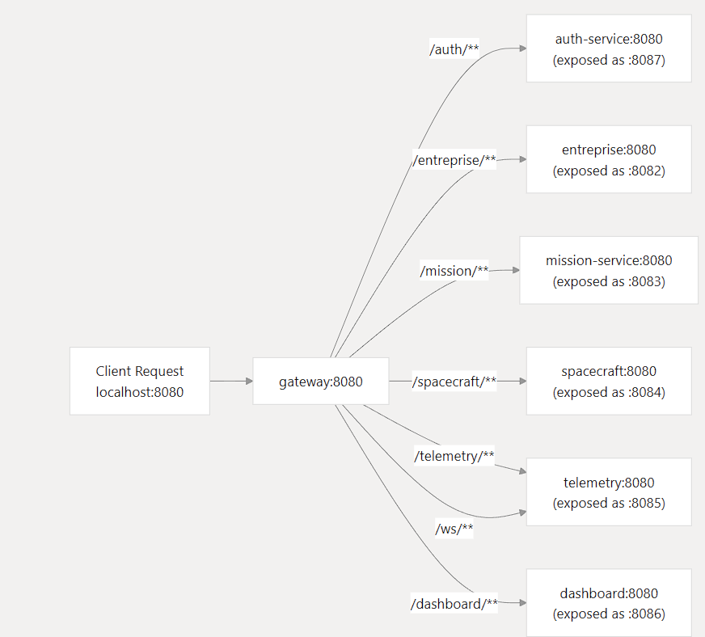  
*Figure 4: Path-based routing via Spring Cloud Gateway (`/auth/**`, `/entreprise/**`, `/mission/**`, etc.).*

---

### Mission Service

Handles mission lifecycle operations, persists to its own PostgreSQL schema:

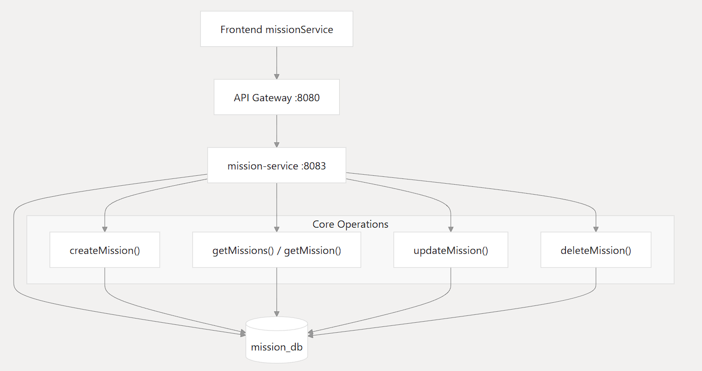  
*Figure 5: Core ops (`createMission()`, `getMissions()`, `updateMission()`, `deleteMission()`) interacting with `mission_db`.*

---

### Spacecraft Service

Manages spacecraft metadata and command issuance; integrates with external satellite APIs and the Telemetry service:

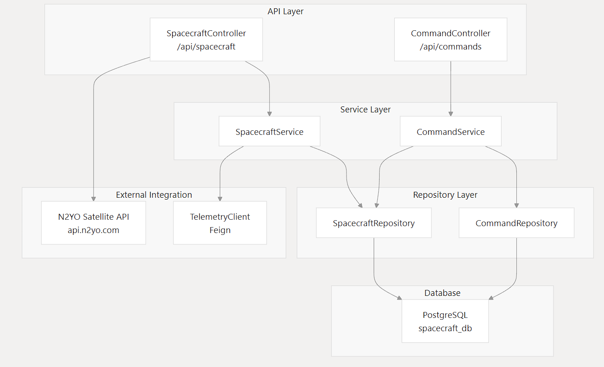  
*Figure 6: Controller → Service → Repository → PostgreSQL, plus Feign-based TelemetryClient and external N2YO API.*

---

### Telemetry Service

Ingests real-time and external telemetry, processes into TimeScaleDB and Kafka topics, and pushes via WebSockets:

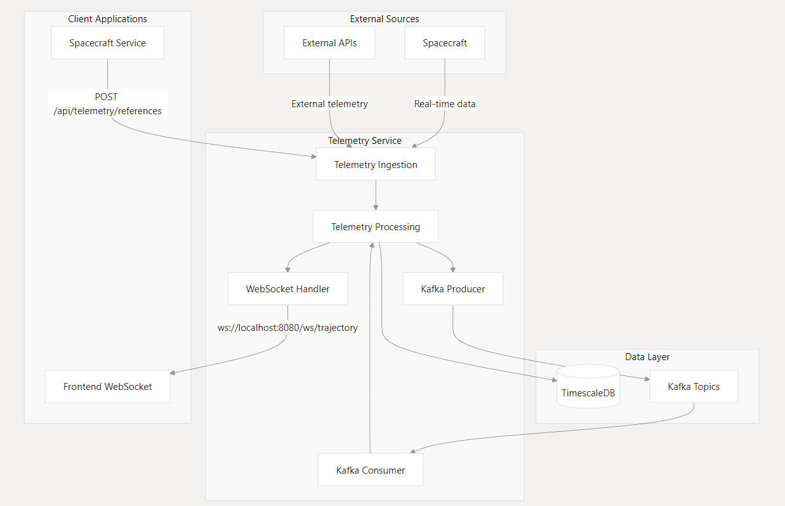  
*Figure 7: Ingestion → Processing → WebSocket Handler (`/ws/trajectory`) and Kafka Producer/Consumer pipelines.*

---

### Dashboard Service

Aggregates metrics and events from all services into a unified view:

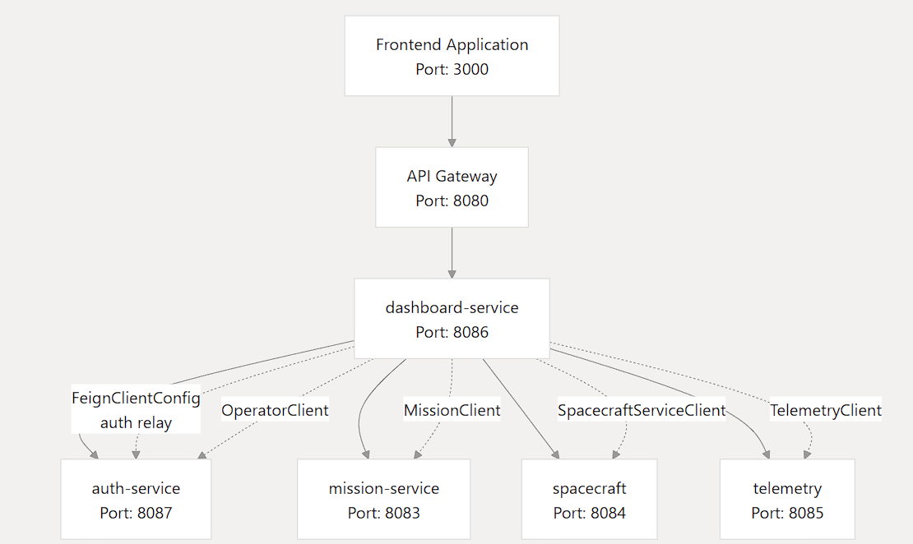  
*Figure 8: Feign clients (Operator, Mission, Spacecraft, Telemetry) behind a single `/dashboard` API.*

---

## Observability (LGTM Stack)

Centralized metrics, logs, traces and profiling via the Grafana/OTel-LGTM stack:

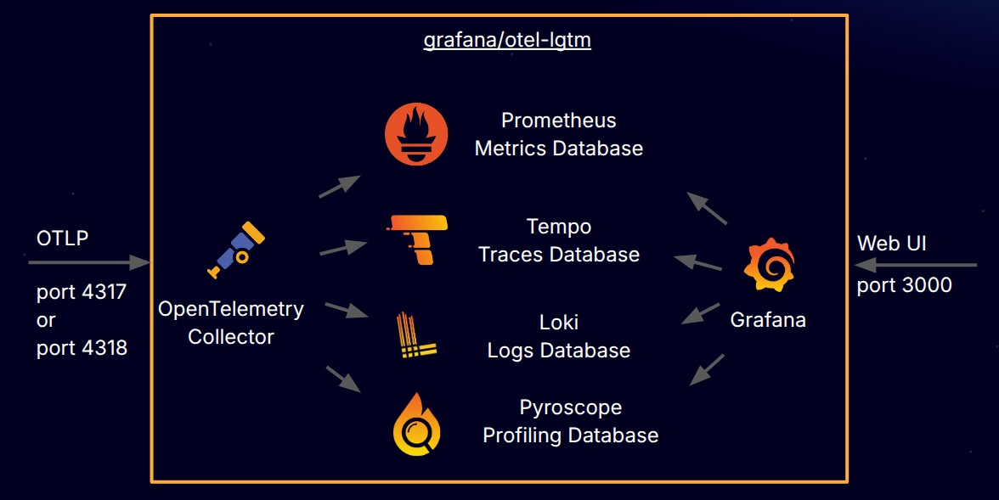  
*Figure 9: OpenTelemetry Collector → Prometheus, Tempo, Loki, Pyroscope → Grafana UI.*

---

## Kubernetes Deployment Flow

Order of manifest application and the flow from storage to external ingress:

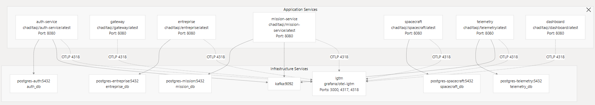  
*Figure 10: PVCs → ConfigMaps/Secrets → Deployments → Services → Ingress → Users.*

---

## Domain Model (Class Diagram)

Core entities, enums and relationships across the micro-services:

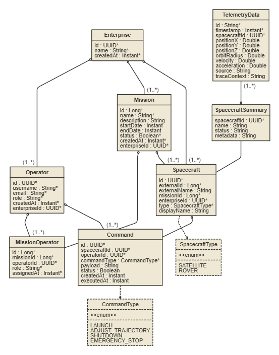  
*Figure 11: `Enterprise`, `Operator`, `Mission`, `Spacecraft`, `Command`, `TelemetryData`, `SpacecraftSummary`, with cardinalities.*

---

## CI/CD with Jenkins

Declarative pipeline automates build, test, image release and Kubernetes rollout:

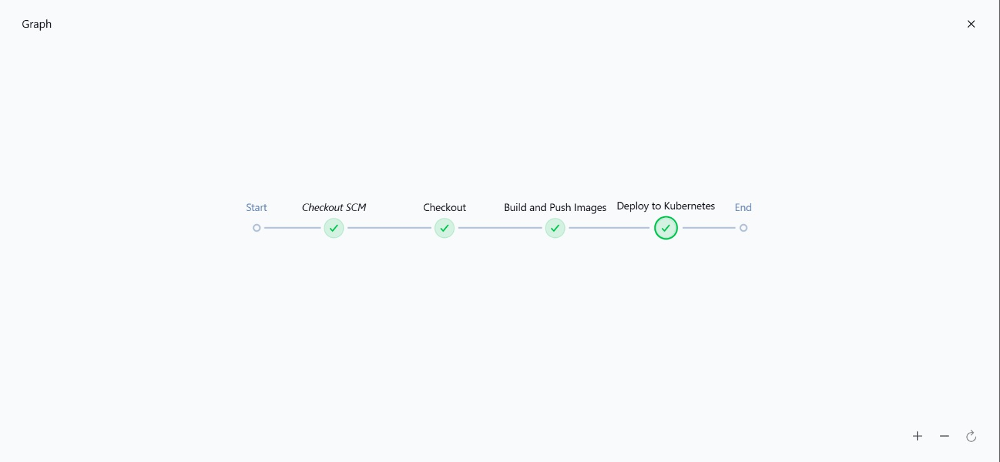  
*Figure 12: Jenkinsfile stages – Checkout → Build → Test → Dockerize → Push → `kubectl apply`.*

---

## Infrastructure as Code with Terraform

Terraform modules provisioning the GKE cluster, managed databases, Kafka/Zookeeper and LGTM components:

---

## Getting Started

```bash
# Clone the repository
git clone https://github.com/shady0503/space-mission-control.git
cd space-mission-control

# 1. Local development with Docker Compose
docker compose up --build -d

# 2. Inspect logs
docker compose logs -f mission-service

# 3. Tear down
docker compose down -v

# 4. Apply to Kubernetes
kubectl apply -f k8s/

# 5. (Optional) Provision GKE & managed infra via Terraform
cd infra/terraform
terraform init
terraform apply
```

- Frontend:  `http://localhost:3000`  
- API Gateway: `http://localhost:8080`  
- Services:    ports 8081…8086  

---

## Contributing

1. Fork & clone  
2. Create branch: `git checkout -b feat/your-feature`  
3. Implement & test  
4. Commit using **Conventional Commits**  
5. Push & open PR – Jenkins will validate  
6. Merge once all checks pass  

See [CONTRIBUTING.md](CONTRIBUTING.md) for full guidelines.


